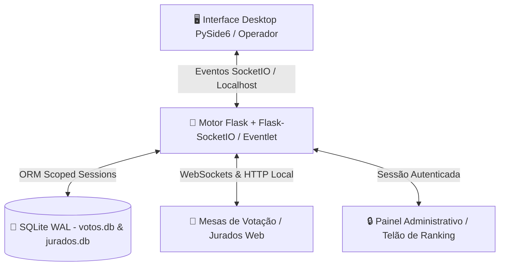

# 🏛️ Sistema de Votação — Mostra Pedagógica (SVMP)
### *Subsecretaria de Tecnologia • Secretaria Municipal de Educação*

-008080?style=for-the-badge)


---

## 📋 Sumário Executivo e Contexto do Evento

O **Sistema de Votação da Mostra Pedagógica (SVMP)** é uma solução tecnológica desenvolvida internamente para dar suporte operacional, integridade e celeridade ao processo avaliativo da **Mostra Pedagógica**.

### 🎯 O Evento: Mostra Pedagógica
A Mostra Pedagógica é um evento institucional que reúne e dá visibilidade a **projetos educacionais inovadores** desenvolvidos por professores e equipes pedagógicas nas unidades escolares da rede municipal. 

* **Objetivo de Incentivo:** Os projetos com melhor classificação na avaliação técnica e pedagógica recebem **incentivo financeiro direto** para continuidade, fomento, expansão e implementação prática em prol da comunidade escolar.
* **Papel do Sistema:** O SVMP fornece aos avaliadores (banca de jurados) uma interface digital intuitiva e ágil para atribuição de notas por critérios normatizados, gerando em tempo real o **ranqueamento automatizado**, com regras determinísticas de desempate e transmissão instantânea para a mesa diretora do evento.

---

## ✨ Repaginação Visual (Edição 2026)

A versão **v1.2 (2026)** passou por uma reformulação completa de interface (UI) e experiência do usuário (UX), elevando o padrão estético e ergonômico da aplicação:

1. **Design System Institucional & Pedagógico:**
   - Paleta de cores harmônica orientada ao tom institucional (`#008080` / Teal Profundo, Ardósia e Branco Puro), proporcionando clareza e redução do cansaço visual dos jurados durante longas sessões de avaliação.
   - Tipografia moderna com hierarquia visual precisa, espaçamentos calibrados e badges informativas.
2. **Visualização Integrada de Projetos em PDF:**
   - Painel dinâmico com leitor integrado de propostas pedagógicas em formato PDF, permitindo que o jurado consulte o dossiê da escola sem sair da tela de notas.
3. **Ergonomia e Responsividade (Mobile / Tablet / Desktop):**
   - Layout fluido adaptado para tablets e smartphones dos jurados, bem como monitores de alta resolução na mesa de controle.
4. **Cards Interativos de Critérios:**
   - Seletores de nota estilizados, cartões com descrições detalhadas de cada métrica avaliativa e validações visuais em tempo real.
5. **Painel de Monitoramento com Matriz de Votos:**
   - Matriz visual em grade (Jurados × Projetos) na aplicação Desktop, indicando instantaneamente o progresso das mesas de votação.

---

## ⚙️ Arquitetura e Engenharia de Software

O SVMP opera sob uma **arquitetura híbrida cliente-servidor** otimizada para redes locais com alta concorrência e tolerância a falhas:



### 🛠️ Stack Tecnológica

| Componente | Tecnologia | Função |
| :--- | :--- | :--- |
| **Gerenciador de Pacotes & Runtime** | `uv` (Astral) | Resolução ultra-rápida de dependências e sincronização determinística |
| **Linguagem Base** | Python 3.13+ | Núcleo de lógica e processamento |
| **Servidor Web & WebSockets** | Flask 3.1+ / Flask-SocketIO / Eventlet | Servidor assíncrono para comunicação em tempo real |
| **Camada de Dados & ORM** | SQLAlchemy 2.0+ / SQLite 3 (WAL Mode) | Persistência transacional com pool de conexões otimizado |
| **Interface Desktop de Controle** | PySide6 (Qt for Python) | Painel local do operador com matriz de status e controle do servidor |
| **Frontend dos Jurados** | HTML5 Semântico / CSS3 Moderno / Vanilla JS | Interface leve, sem dependências externas, alta performance |

---

## 📊 Critérios Avaliativos e Motor de Ranqueamento

A atribuição de notas é segmentada em **5 Critérios Técnicos (CT)** com pontuação de **0 a 20** cada:

1. **Critério 1 (CT1):** *Conformidade com o tema / grupo temático / Plano de Metas.*
2. **Critério 2 (CT2):** *Criatividade (metodologia, resolução de problemas e intervenção pedagógica).*
3. **Critério 3 (CT3):** *Exportabilidade (ações, estratégias, aplicabilidade e replicabilidade).*
4. **Critério 4 (CT4):** *Qualidade em todo projeto / prática apresentado.*
5. **Critério 5 (CT5):** *Impacto (resultados esperados, desempenho do estudante e teoria da mudança).*

### 🏆 Segmentação e Regras de Desempate
Os projetos são computados em duas categorias independentes:
* **Categoria 0:** Educação Infantil (Creche e Pré-Escola).
* **Categoria 1:** Ensino Fundamental (Fundamental I, II e EJA).

**Algoritmo de Desempate (Top 3):**
Em caso de igualdade na soma das notas (`Total Geral`), o sistema aplica automaticamente a seguinte ordem de desempate:
$$\text{Total Geral} \longrightarrow \text{CT3 (Exportabilidade)} \longrightarrow \text{CT4 (Qualidade)} \longrightarrow \text{CT2 (Criatividade)}$$

---

## 🛡️ Mecanismos de Segurança e Integridade

O sistema foi concebido com rigorosos padrões de segurança para ambientes de avaliação pública interna:

1. **Controle de Sessão Única e Bloqueio de Concorrência (Anti-Colisão):**
   - Implementação de trava de concorrência em nível de banco de dados (`acesso` flag no `JuradoRepository`).
   - Cada jurado só pode ser autenticado em um único dispositivo simultaneamente.
   - Geração de `BOOT_ID` criptográfico a cada inicialização da aplicação, invalidando credenciais residuais de sessões anteriores.
2. **Chave Criptográfica Efêmera:**
   - Secret key gerada dinamicamente via `secrets.token_hex(24)` a cada reinicialização do serviço.
3. **Isolamento e Controle de Acesso Administrativo:**
   - Rota `/admin` e endpoints de apuração (`/rank`, `/painel`, `/encerrar_votacao`) protegidos por autenticação segregada via variáveis de ambiente (`ADM_LOGIN` e `ADM_PASS`).
4. **Resiliência e Integridade de Concorrência no Banco de Dados:**
   - SQLite configurado com `PRAGMA journal_mode=WAL` (Write-Ahead Logging), permitindo leituras simultâneas e escrita não bloqueante.
   - Gerenciamento de sessões via `scoped_session` com context managers (`try / commit / rollback / finally close`), eliminando locks de banco e vazamento de conexões.
5. **Trilha de Auditoria em Tempo Real:**
   - Cada voto registrado gera um log com timestamp no arquivo `log_votos.txt` e um evento WebSocket imediato para a central de monitoramento.
6. **Operação Segura em Rede Local (Air-Gapped / Intranet):**
   - Sistema opera integralmente em rede fechada (LAN / Wi-Fi local dedicado), eliminando exposição a vetores de ataque externos via internet.

---

## 🚀 Como Instalar e Executar

O projeto utiliza o **`uv`**, o gerenciador de pacotes e ambientes virtuais ultrarrápido para Python.

### 1. Pré-requisitos
* Python 3.13 ou superior instalado.
* `uv` instalado ([Guia oficial do uv](https://github.com/astral-sh/uv)).

### 2. Inicialização Rápida

```bash
# 1. Clonar ou navegar até o diretório do projeto
cd /home/thyez/Documentos/softwares/mostra_pedagogica

# 2. Sincronizar o ambiente virtual e instalar todas as dependências
uv sync

# 3. Executar o Painel de Controle Desktop e Servidor
uv run ui.py
```

### 3. Operação pela Interface Desktop
1. Clique em **"Ligar Servidor"** no painel da aplicação.
2. O sistema exibirá o **endereço IP local** e a porta para as mesas:
   - **Acesso dos Jurados:** `http://<IP_DO_SERVIDOR>:5000`
   - **Painel Administrativo:** `http://<IP_DO_SERVIDOR>:5000/admin`
3. Acompanhe a matriz de votos em tempo real na aba lateral da aplicação.

---

## 🔄 Fluxo Operacional e Rotina de Backups

Para eventos com múltiplos dias de avaliação ou baterias de projetos, utilize a rotina de isolamento:

### 📅 Rotina Diária
1. **Início da Sessão:** O operador liga o servidor pela UI e inicia a votação.
2. **Durante o Evento:** Acompanhamento em tempo real via tabela interativa e logs da aplicação Desktop.
3. **Encerramento da Etapa:** O administrador encerra a votação e emite o ranking oficial.
4. **Execução de Backup e Higienização:** Ao término do dia, execute o script automatizado de backup:
   ```bash
   chmod +x backup.sh
   ./backup.sh
   ```
   *O script gera uma pasta `backup_AAAAMMDD_HHMMSS/` com snapshots dos bancos SQLite (`votos.db` e `jurados.db`), limpa as tabelas ativas e prepara o ambiente para o dia seguinte.*

---

## 👨‍💻 Dados Institucionais e Autoria

| Atributo | Detalhe |
| :--- | :--- |
| **Autor & Engenheiro Responsável** | **Thyéz de Oliveira Monteiro** |
| **Cargo** | Assessor de Informática |
| **Função** | Engenheiro de Software |
| **Matrícula Funcional** | `9506219-2` |
| **Órgão** | Secretaria Municipal de Educação |
| **Setor / Lotação** | Subsecretaria de Tecnologia — **Sala 25** |
| **Versão do Software** | **v1.2** |
| **Data de Homologação** | **17 de agosto de 2026** |

---

## 🔒 Termo de Uso e Confidencialidade

> [!CAUTION]
> **SOFTWARE DE USO INTERNO E EXCLUSIVO**  
> Este sistema foi projetado e desenvolvido sob medida para as demandas institucionais da **Secretaria de Educação**.  
> É estritamente **proibida a reprodução, cópia, compartilhamento, redistribuição ou comercialização**, total ou parcial, deste código-fonte e seus artefatos associados sem a expressa autorização formal da **Subsecretaria de Tecnologia**. Todos os direitos reservados.
